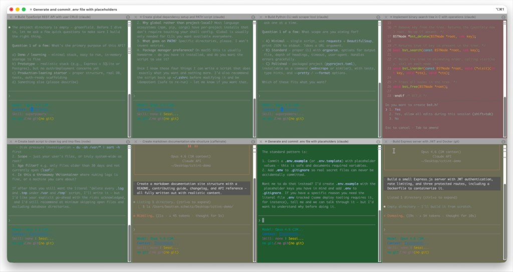

# cctint

[](https://github.com/bschwitz3/cctint/actions/workflows/ci.yml)
[](./LICENSE)
[](https://github.com/bschwitz3/cctint)
[](https://iterm2.com)

Tint the iTerm2 background from **Claude Code** session state so many tabs stay scannable at a glance.

| State     | Default tint | Meaning                        |
| --------- | ------------ | ------------------------------ |
| `idle`    | muted green  | Waiting for your input         |
| `running` | muted amber  | Working (e.g. tool in flight)  |
| `waiting` | muted red    | Blocked on approval / prompt   |
| `error`   | deep red     | Tool failed, denied, or crash  |

## Demo

[](https://github.com/bschwitz3/cctint/raw/main/docs/cctint-demo.mp4)

Source in repo: [`docs/cctint-demo.mp4`](./docs/cctint-demo.mp4)

## Requirements

macOS · iTerm2 · [Bun](https://bun.sh) to **build** · Bun or Node ≥18 at runtime · zsh or bash (for the exit `trap`)

## Install

```bash
git clone https://github.com/bschwitz3/cctint.git   # or your fork
cd cctint && bun install && bun run build
./scripts/install-bin.sh                          # or PREFIX=$HOME/.local/bin ./scripts/install-bin.sh
cctint install
source ~/.zshrc    # or new terminal
```

Then open iTerm2, run `claude`, and backgrounds should follow state.

**`cctint install`** merges hooks into `~/.claude/settings.json` (`SessionStart`, `SessionEnd`, `UserPromptSubmit`, `PreToolUse`, `PostToolUse`, `Notification`, `Stop`) and appends a guarded `claude()` wrapper that runs `cctint reset` on exit. Other hooks are left alone.

- `--scope project` → `./.claude/settings.json`
- `--no-shell` → skip the shell wrapper

## Config

`~/.config/cctint/config.json` (merge with optional `./.cctint.json`). Unset keys use built-ins:

```jsonc
{
  "mode": "live-color",
  "colors": {
    "idle": { "bg": "#224a22" },
    "running": { "bg": "#4a4a22" },
    "waiting": { "bg": "#5a2828" },
    "error": { "bg": "#6a2222" }
  },
  "enabled": true,
  "logLevel": "warn"
}
```

- **`live-color`** (default) — `SetColors=bg=…` OSC; no extra iTerm setup.
- **`profile-switch`** — `SetProfile=…`; needs four profiles + `profiles` in config.

## CLI (manual)

```bash
cctint reset       # recover default background
cctint uninstall   # remove hooks + shell block
```

## Troubleshooting

| Issue | Check |
| ----- | ----- |
| No tint | `echo $TERM_PROGRAM` → must be `iTerm.app` |
| settings.json hook errors | `cctint uninstall && cctint install` |
| Stuck color after `/exit` | New shell, or `unset -f claude && source ~/.zshrc` |
| Wrong palette | Override `colors` in config |

## Uninstall

```bash
cctint uninstall
sudo rm /usr/local/bin/cctint    # if installed system-wide
rm -rf ~/.config/cctint
```

## More

- Contributing: [CONTRIBUTING.md](./CONTRIBUTING.md) · Bugs: [.github/ISSUE_TEMPLATE/bug.yml](./.github/ISSUE_TEMPLATE/bug.yml)
- Changelog: [CHANGELOG.md](./CHANGELOG.md) · Security: [SECURITY.md](./SECURITY.md)

## License

[MIT](./LICENSE) © 2026 Bastien Schwitz
